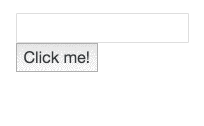
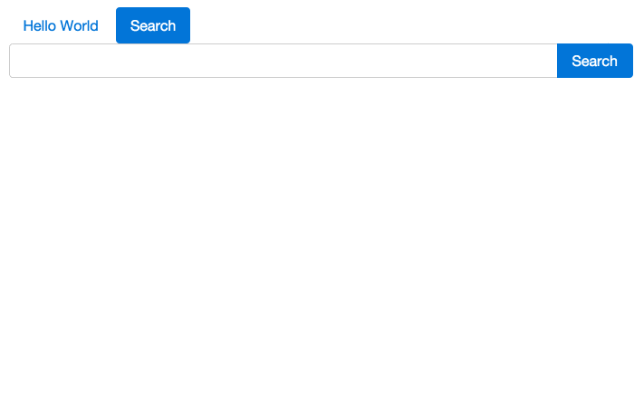
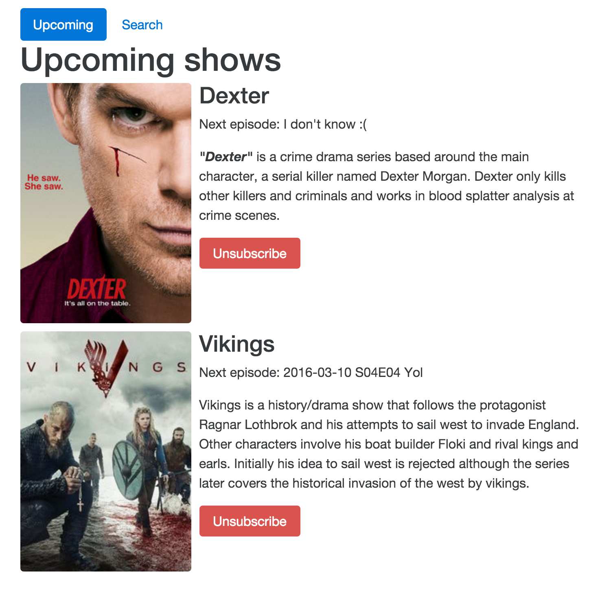

# Angular 2 Lab

Before we start. If you see any typos or errors, please let me know.  
– With that said, let's code some fine javascript.

What we will create: https://tjoskar.github.io/angular2-labb/

## Prologue - Get started

### Set up the project

- Clone the project:

```
$ git clone -b chapter/2 https://github.com/tjoskar/angular2-labb.git
```

- Install dependencies:

```
$ cd angular2-labb
$ npm install
```

- Boot up the application:

```
$ npm start
```

- Navigate to `http://localhost:8000`

Looking good? - Yes?

#### Other npm comands

comand | action
--- | ---
npm run start / npm start | compile and start the application (auto rebuild)
npm run build | build application for production use
npm run test / npm test | execute unit tests
npm run webdriver:update | Update / install webdriver for e2e tests
npm run e2e | execute e2e tests

---

### Use a typescript aware editor (if you want to use typescript)

#### You must choose, but choose wisely
Just kidding, you can change whenever you like.

#### Atom (My favorite)
https://atom.io/

Install `atom-typescript` addon:
```
$ apm install atom-typescript
```

Or install the add-on through the settings page: `cmd+,` (or `ctr+,` on windows/linux)

pros:
- Extremely easy to customize! If you want to change something, just do it!
- Good integration with git (annotate changes in tree- and file view)
- Massive collection of add-ons

cons:
- Slow at startup and can get slow for large files (it will literally die for files >2mb)
- `atom-typescript` can have a bad day and are not always 100% stable


#### Visual studio code
https://code.visualstudio.com/

pros:
- Support of typescript out of the box
- Debugger right inside the editor (javascrip, python, php)
- Fast

cons:
- Few add-ons
- Can only change color theme (not ui theme)
- No tabs? - Can get confusing


#### Sublime Text 3
https://www.sublimetext.com/3

https://github.com/Microsoft/TypeScript-Sublime-Plugin

pros:
- Blazing fast!
- Every one loves sublime text 💖

cons:
- The typescript add-on feels sketchy


#### Webstorm
https://www.jetbrains.com/webstorm/

pros:
- Fully integrated IDE

cons:
- Fully integrated IDE


#### Vim
https://github.com/Valloric/YouCompleteMe

pros:
- It's cool

cons:
- [You have to know vim](https://twitter.com/filip_woj/status/588815049063591937)

---

### Take a look at the code

```
├── e2e                             // Folder for e2e tests
├── public                          // Dev server will serve from this folder
├── src                             // All application code goes here
│   ├── directive                   // Folder for shared directives
│   ├── hello-world                 // Hello word component, start here!
│   ├── lib                         // Folder for shared services
│   │   ├── contracts               // Contracts for tv maze API
│   │   │   ├── episode.ts
│   │   │   └── show.ts
│   │   ├── providers.ts
│   │   ├── storage
│   │   │   ├── contracts
│   │   │   │   └── storage.ts      // Interface of the storage database
│   │   │   ├── indexed-storage.ts  // IndexedDB implementation
│   │   │   ├── local-storage.ts    // Local storage implementation
│   │   │   ├── storage.ts          // Abstract class of storage
│   │   │   └── test                // Folder for test cases for storage
│   │   ├── style                   // Makeup
│   │   ├── subscribe.service.ts    // Service for subscribing and unsubscribing series
│   │   ├── test                    // Folder for test cases
│   │   └── tv-maze.ts              // Service that create http requests to tv maze
│   ├── app.component.ts            // One component to rule them all
│   ├── base-template.html          // A base template which will be used on all pages
│   ├── boot.ts                     // Boot file that bootstrap the application
│   ├── index.html
│   ├── search                      // See "Chapter 2"
│   └── upcoming                    // See "Chapter 3"
├── typings                         // Folder to keep typescript definitions
├── karma.conf.js                   // Configuration for karma
├── package.json
├── protractor.conf.js              // Configuration for protractor
├── README.md                       // This file
├── tsconfig.json                   // Typescript configuration
├── tslint.json                     // tslint configuration
├── typings.json                    // typings configuration
├── webpack.config.js               // Configuration for webpack
└── webpack.prod.config.js          // Configuration for webpack - production mode
```

### Examine the Final Product

Head over [here](http://tjoskar.github.io/angular2-labb/) and play around with the final project. Think about how you would separate your different components and functionality.

---

## Chapter 1 - Feel the flow

1. Start off by navigate to `http://localhost:9000/`.
1. Open up `src/hello-world/my-input.component.ts` in your (new) favorite editor.
1. Play around and get a feeling of how events and data binding works.


### Examples of things to do:

##### 1. Display what you type:


##### 2. Display after click



##### 3. Create a new component that you use in an other component, like this:

```javascript
import { Component, Input, Output, EventEmitter } from '@angular/core';

@Component({
    selector: 'city-dropdown',
    template: `
        <select>
            <option value=""></option>
            <option value="Ankarsrum">Ankarsrum</option>
            <option value="Västervik">Västervik</option>
            <option value="Stockholm">Stockholm</option>
        </select>
    `
})
class CityComponent {
    @Input() city;
    @Output() cityChange = new EventEmitter();
}

@Component({
    selector: 'my-input',
    template: `
        <input [(ngModel)]="username">
        <city-dropdown></city-dropdown>
        <br />
        Username: {{username}}
        <br />
        City: {{city}}
    `,
    directives: [CityComponent]
})
class MyInputComponent {
    username = 'Jesse';
    city = '';
}
```

– Now, try to bind the value of the drop-down to `city` inside `MyInputComponent`.

##### 4. Play around with local view-variables:

```html
<button (click)="undefined">Click me</button> <!-- Why do you think we need this? -->
<input #myInput>
{{myInput.value}}
```

Or maybe:
```html
<button (click)="myInput.value = 'Hi'">Click me</button>
<input #myInput>
```

##### 5. Print all values in an array, eg. [1, 2, 3, 4, 5] with `*ngFor`

```javascript
@Component({...})
class MyInputComponent {
    numbers = [1, 2, 3, 4, 5];
}
```

**_Fun facts_**:

Did you know that:
```html
<my-comp *ngFor="let show of shows" [show]="show"></my-comp>
```

de-sugars it into:
```html
<my-comp template="ngFor let show of shows" [show]="show"></my-comp>
```

which de-sugars into:
```html
<template ngFor let-show [ngForOf]="shows">
    <my-comp [show]="show"></my-comp>
</template>
```

You can find solutions here: https://gist.github.com/tjoskar/71e0dce55e75e90db971

What to know more about the template syntax: https://angular.io/docs/ts/latest/guide/template-syntax.html

Read why Angular choose this template system http://angularjs.blogspot.se/2016/03/why-angular-renders-components-with.html

---

## Chapter 2 - Finding Nemo

Create a new component, a search component, with the following criteria:
- The search component should have a single input field
- The search component should give results in real time (when you type).
- The user should be able to subscribe to a chosen show.



I have included some skeleton code inside the `search` folder. If you want to start from scratch, just delete the folder.

**_Good to know_**

`lib/tv-maze.ts`
```javascript
searchShow('game of thrones')
	.subscribe(
		showsResult => console.log(showsResult), // this will print an array of shows (search result)
		error => console.error(':(', error)
	);
```

`lib/subscribe.service.ts`
```javascript
const showId = 1;
subscribeShow(showId)
	.then(() => console.log('We do now subscribe to show with id = 1'))
	.catch(error => console.error(':(', error));
```

Proposed solution exist under the branch `solution/2`

## Chapter 3 - Make it count

Create a component to list all subscribe series. Call it `UpcomingShows`.

Challenge:
- Create a pipe to filter out the next episode to air.
- Create a directive for lazy load images (This can be tricky. – proposed solution exist)
- Fetch and update the show info in local storage (I don't have any solution for this but it should be fairly easy).
- The user should be able to unsubscribe to a show.
- The user should be able to view all episodes for a show (I don't have any solution for this but it should be fairly easy).


Example layout:



– Have no idea where to start? Take a look at this skeleton code: https://gist.github.com/tjoskar/9402044f45dc7d2ecbb0 (don't copy without understanding, instead ask a friend. I'm your friend)

**_Remember!_**
Update the routing in `app.component.ts` and `base-template.html`.

## Chapter 4 - Test me

Writing and executing test cases for front-end are hard. But nevertheless important.
All browsers vendors implement the same features in different ways, they have different bugs, you do not control the upgrade cycle. - You are not in control over your own code.

Furthermore; Different devices have different input methods (mouse, keyboard, touch) and different outputs to consider (desktop, laptop, tablet, mobile, retina display, screenreader), and the end user can adapt the output (enlarging text, changing the color settings, etc.).

So you need tests, that's for sure.

### Unit test
> Let's get started by writing some unit tests.

To be able to run the same test case in different browsers, we need a test-runner and not any test runner. We need a test runner that can start up and communicate with different browsers.
We have two options: [Testem](https://github.com/testem/testem) and [Karma](http://karma-runner.github.io/). We will go with Karma for now.

We will also need to choose a test-framework (you wouldn't get far with `console.assert`). Unfortunately the Angular team has already made the choice for us, [Jasmine](http://jasmine.github.io/2.4/introduction.html), so lets go with the flow.

First we need to install a few new dependencies (they should already be listed in you `package.json`):
```
jasmine-core               // Core lib for jasmine
karma                      // Core lib for karma
karma-jasmine              // So Karma understand jasmine
karma-mocha-reporter       // A better test reporter
karma-electron-launcher    // So Karma can start Electron
karma-sourcemap-loader     // So Karma understands sourcemaps
karma-webpack              // So Karma and webpack can talk to each other
electron-prebuilt          // Electron
source-map-loader          // So webpack understand sourcemaps
```

Since we are using typescript and `modules`, we need some way of bind all this modules so the browser can understand them, that is why we are using webpack. - Which is awesome but this require some extra work before we can run the test case.

Take a look inside `karma.conf.js`. Karma, will only load one javascript-file (`unit-test.bundle.js`) and pass it to webpack. This file will however load all test files.
Take a look inside `unit-test.bundle.js`. First of all we load some `polyfills` and angular stuff but then we use the the context method on `require` that webpack created in order to tell webpack what files we actually want to import. For each test-file we find we will call the context function that will require the file and load it. Cool right?

Ready to write some unit tests? – [Let's get started](https://youtu.be/IKqV7DB8Iwg?t=59s).

Take a look at: `lib/storage/test/local-storage.test.ts`. Looks straightforward right?
Take a look at: `lib/test/subscribe.service.test.ts` for a more complex test case.

To create a new test case you only have to create a new file which the filename ends with `.test.ts`.

```
$ npm test // This will run all unit tests
```

### End to end testing

Take a look inside the `e2e`.

You will need selenum driver to run the test cases. Just run `$ npm run webdriver:update` to download a selenium driver.

Then you can run the e2e-tests by:

```
$ npm run webdriver:update // You need to run this at least once
$ npm run e2e
```

-- Happy testing

## Chapter 5 - Don't tell me what to do

### Change detection strategy

Play around with different change detection strategies. For instance, use immutable objects and set the `changeDetection` to: `ChangeDetectionStrategy.OnPush`:

```javascript
import { Component, Input, ChangeDetectionStrategy } from '@angular/core';

@Component({
    selector: 'my-comp',
    template: `{{myData.id}}, {{myData.name}}`,
    changeDetection: ChangeDetectionStrategy.OnPush
})
class MyComponent {
    @Input() myData;

    ngOnChanges(inputChanges) {
        if (inputChanges.myData) { // We have a new model
            console.log(inputChanges.myData.currentValue);
        }
    }
}
```

Take a look at these blog posts:
- http://victorsavkin.com/post/133936129316/angular-immutability-and-encapsulation
- http://victorsavkin.com/post/110170125256/change-detection-in-angular-2
- http://blog.thoughtram.io/angular/2016/02/22/angular-2-change-detection-explained.html

Video:
- https://www.youtube.com/watch?v=CUxD91DWkGM
- https://www.youtube.com/watch?v=jvKGQSFQf10

### View Encapsulation

OMG! Native Shadow DOM!

```javascript
import { Component, ViewEncapsulation } from '@angular/core';

@Component({
	selector: 'yoo-boy',
	templateUrl: 'template.html',
	styles: [`
		body { /* You have no power in the shadow of DOOM (Do you see the joke? – No? Okey) */
			background: green;
		}
	`],
	encapsulation: ViewEncapsulation.Native // Change this to `ViewEncapsulation.None`
})
class YooBoy {}
```

## Chapter 6 - Make it fast

### Use service worker! OMG Service worker!

Don't have anything to do with Angular but it is super cool so check it out!

Take a look at `src/sw.js` in branch `service-worker`. With that inplace and some other hacks (take a look at `src/index.html`) we can get a load time at about ≈0ms! And that is awesome.

We can also (soon) use sw to sync all shows in the background: https://github.com/WICG/BackgroundSync/blob/master/explainer.md#periodic-synchronization-in-design


### Use web workers!

OBS! Proposed solution do not exist.

- We can't use `localstorage` anymore. Create a new storage implementation for `indexedDB` (exist is `src/lib/storage`).
- We can't use `webpack` as we do today since all code that are going to execute in a web-worker must be in a separate file(s).

# Congrats!

You are awesome!
