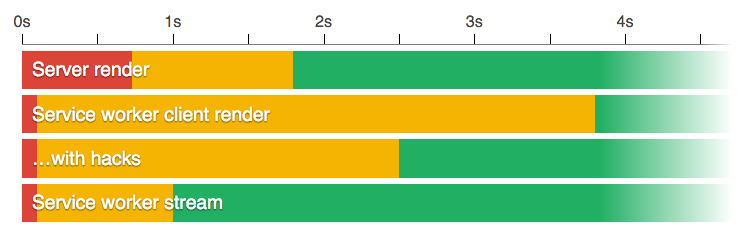

build-lists: true
autoscale: true


^ Som ni redan vet så kommer huvud fokus av denna presentation och kväll vara tillängnad åt Angular 2 men låt oss först prata lite snabbt om ES6

---

# [fit] ES6

^ Eller Harmony som det kanske kallas

---

# [fit] Harmony

^ Eller ECMAScript version 6 om man vill vara tydlig

---

# [fit] ECMAScript version 6

^ Eller ES2015 som det nu officielt heter

---

# [fit] ES2015

^ Kärt barn har många namn.
Internet har fullständigt kokat av upphätsning över ES6 och ES6 är en big deal för javascrip världen.
Varför? Låt oss bara lite snabbt kolla på tids axlen:

---

## History of ECMAScript

- 1997: ES1
- 1998: ES2
- 1999: ES3
- 2007: ES4
- 2009: ES5
- 2015: ES6
- 2016: ES7
- 2017: ES8

^ ES2: inga nyheter
ES3: Regular expressions och try/catch. Man ska komma ihåg att internet var inte så stort 1999, PC hade precis börjat letat sig in i vart och varanat hem
ES4: Åtta år senare kommer en stort genombrott, vi skulle få classer, ett modul system, statisk typning, iteratorer. Detta skulle bli stort.
ES5: Vi fick strict mode. Som vi hade väntat!
Okej, låt oss böja med några få nyhter i ES6. När jag började skriva denna presentation så försökte jag

---

## const

```javascript
const a = 1;
a = 2; // TypeError: Assignment to constant variable
```

```javascript
const arr = [1, 2];
arr.push(3);
arr.someRandomProp = 'Jepp Jepp';
```

---

## Arrow functions

```javascript
const add = function(a, b) { return a + b; }
```

^ Detta är en av funktionerna som javascript saknade mest.
javascript är i regel enekl trådat, vilket gör att allt sker asyncront.
Vilket gör att vi måste ha callbacks
enkel tråd => async => classback => lamda functioner

---

## Arrow functions

```javascript
const add = (a, b) => a + b;
```

---

## Arrow functions

```javascript
const A = () => {};
```

- `A.prototype === undefined`
- `A.bind`, `A.call` and `A.apply` are defined but can not change function scope
- Lexical scope: `arguments` and `this` are defined by host
- `new A(); // TypeError: () => {} is not A constructor`

---

## for of

```javascript
const arr = [3, 5, 7];
a.note = 'LA FAMILIA ES TODO';

for (let key in arr) {
   console.log(key); // 0, 1, 2, note
}

for (let value of arr) {
   console.log(value); // 3, 5, 7
}

arr.forEach(v => console.log(v)); // 3, 5, 7
```

---

## for of

```javascript
const arr = undefined;

for (let key in arr) { // OK
   console.log(key);
}

for (let value of arr) { // Cannot read property 'Symbol(Symbol.iterator)' of undefined
   console.log(value);
}

arr.forEach(v => console.log(v)); // Cannot read property 'forEach' of undefined
```

---

## Promises
^ Min favorit! Har funits länge nu men är entligen med i specifikationen

---

```javascript
function findShowById(show, cb) {
    repo.getShowById(show.ids.id, function(error, _show) {
        if (error) {
            cb(error);
        } else if (_show) {
            cb(undefined, _show);
        } else {
            repo.getShowByTheTvDbId(show.ids.theTvDb, function(error, _show) {
                if (error) {
                    cb(error);
                } else if (_show) {
                    cb(undefined, _show);
                } else {
                    repo.getShowByImdbId(show.ids.imdb, function(error, _show) {
                        if (error) {
                            cb(error);
                        } else if (_show) {
                            cb(undefined, _show);
                        } else {
                            cb(new MissingShowError('Can not find show:' + error));
                        }
                    });
                }
            });
        }
    });
}
```

---

```javascript
function findShowById(show) {
    return repo.getShowById(show.ids.id)
        .catch(() => repo.getShowByTheTvDbId(show.ids.theTvDb))
        .catch(() => repo.getShowByImdbId(show.ids.imdb))
        .catch(error => {
            throw new MissingShowError('Can not find show', error);
        })
        .then(result => console.log('Woop Woop! We have a result', result));
}
```

^ Promises kanske inte uppförsig som man alltid vill och de kan vara svårare att debugga.

---

## Promises - The bad part

- No lazy execution
- No abort
- No retry
- Single value

^ Ibland kan man vilja skicka runt ett promises object men inte exikvera det förs man vet att det behövs
Det går inte att avbryta ett promises. XMLHttpRequest

---

## Reactive Programming (rxjs)

^ Jag kommer inte hinna gå igenom detta i ditalj men Angular 2 har en tät kopling till just Reactive Programming så jag kommer gå igenom det övergripande

---


---

### Use case - Autocomplete search

---

### Autocomplete search - Problems

- Debounce
- Min search string length
- HTTP response order

---

```javascript
const source = Rx.Observable.fromEvent($input, 'keyup');
```

---

```javascript
const source = Rx.Observable.fromEvent($input, 'keyup')
    .map(event => event.target.value); // Input text
```

---

```javascript
const source = Rx.Observable.fromEvent($input, 'keyup')
    .map(event => event.target.value) // Input text
    .filter(text => text.length > 3); // Only if the text is longer than 3 characters
```

---

```javascript
const source = Rx.Observable.fromEvent($input, 'keyup')
    .map(event => event.target.value) // Input text
    .filter(text => text.length > 3)  // Only if the text is longer than 3 characters
    .debounce(400);                   // Pause for 400ms
```

---

```javascript
const source = Rx.Observable.fromEvent($input, 'keyup')
    .map(event => event.target.value) // Input text
    .filter(text => text.length > 3)  // Only if the text is longer than 3 characters
    .debounce(400)                    // Pause for 400ms
    .flatMapLatest(text => {
        return this.http(`${url}?q=${text}`); // Only care about the latest search string
    });
```

---

```javascript
const source = Rx.Observable.fromEvent($input, 'keyup')
    .map(event => event.target.value) // Input text
    .filter(text => text.length > 3)  // Only if the text is longer than 3 characters
    .debounce(400)                    // Pause for 400ms
    .flatMapLatest(text => {
        return this.http(`${url}?q=${text}`); // Only care about the latest search string
    });

source.subscribe(
          result => updateView(result),
          error => console.error('Oh my god!!' + error));
```

---

---

## ES.Next

---

## Decorators

```javascript
class Heisenberg {

    constructor() {
        ...
    }

}
```
^ Vad är decorators? Om ni har arbetat med pythons decorators så kommer ni känna er hemma annars så kommer här en snabb genomgång
Låt oss säga att vi har en enkel klass:
Låt oss nu säga att vi vill lägga på meta data

---

## Decorators

```javascript
function canCook(target) {
    target.canCook = true;
}

@canCook
class Heisenberg {

    constructor() {
        ...
    }

}

const heisenberg = new Heisenberg();
heisenberg.canCook // true
```

^ Och vad är det som är fantastiskt med detta?
Detta möjliggör att vi kan lägga på egensaker som kan senare användas. Ex:

---

## Decorators

```javascript
@template(`
    <button>Click me</button>
`)
class ButtonController {

}
```

---

## Decorators

```javascript
import {autoInject, dependencyInjection} from 'autoinject';

class Db {

    connectionString: 'user:pass@local';

}

@autoInject
class MyClass {

    db: Db;

    constructor(db: Db) {
        this.db = db;
    }
}

const myClass = dependencyInjection(MyClass);
myClass.db.connectionString // 'user:pass@local'
```

^Och det stannar så klart inte här utan man kan göra ganska mycket med decorators. I sommras skrev jag en dependncy injector med hjälp av decorators (och typescript):

---

## Decorators

```javascript
class MrWhite {

    @readOnly name = 'Heisenberg';

    knocking() {
        return 'I am the one who knocks.';
    }

}

function readOnly(target, name, descriptor) {
    descriptor.writable = false;
}
```

---

## Decorators

```javascript
class MyClass {

    @memorizeFor(1000)
    fetchFromServer(delta) {
        ...
    }

    @trace()
    complexFunction() {
        ...
    }

}
```

---

## Other ES.Next features

- System global: https://github.com/tc39/proposal-global
- Call constructor: https://github.com/tc39/ecma262/blob/master/workingdocs/callconstructor.md
- observable: https://github.com/zenparsing/es-observable
- decorators: https://github.com/wycats/javascript-decorators/blob/master/README.md
- async/await https://github.com/tc39/ecmascript-asyncawait
- SIMD: http://tc39.github.io/ecmascript_simd/
- This binding: https://github.com/zenparsing/es-function-bind

---

## Typescript

^ Alla vettiga språka har några olika datatyper. Eller hur?
I javascript har vi 7 olika typer:

---

## Typescript

- Boolean
- Null
- Undefined
- Number
- String
- Symbol
- Object

---

## Typescript

- `typeof Array() === 'object'`
- `typeof ( new Map() ) === 'object'`
- `typeof NaN === 'number'`
- `typeof null === 'object'`

^ Man kan tycka vad man vill om typning men eftersom vi uppenbarlige har olika datatyper så är det ide att annotera metoder.

---

## Typescript

```javascript
function area(r) {
    return Math.PI * r * r;
}
```

---

## Typescript

```javascript
function area(r: number): number {
    return Math.PI * r * r;
}
```

---


---

## Typescript

```javascript
const obj = {
    firstNumber: 1,
    secondNumber: 2,
    threadNumber: 3
};

function add(a, b, c) {
    return a + b + c;
}

const result = add(obj.firstNumber, obj.secondNumber, obj.threadNunber);
console.log(result);
```

---

## Typescript

```javascript
const obj = {
    firstNumber: 1,
    secondNumber: 2,
    threadNumber: 3
};

function add(a, b, c) {
    return a + b + c;
}

const result = add(obj.firstNumber, obj.secondNumber, obj.threadNunber);
console.log(result); // NaN
```

---

## Typescript

```javascript
const obj = {};
obj.name = 'Mr. White'; // Property 'name' does not exist on type {}.
```

^ Vilket är förvisso sant MEN det hindrar mig från att programera javascript. Om ni börjar använda typescript så kommer ni springa på minor. Alla gör det och typescript är inte felfritt
- Jag tror att jag har rapporterart ett tiotal buggar.
Vissa är inte återgärdade.

---


---

## Typescript

```javascript
const obj = {};
obj.name = 'Mr. White';
// Property 'name' does not exist on type {}.
```

^ Så det finns problem men det finns också stora fördelar, så pass stroa fördelar som har gjort vänt mig från att vara emot typescript till att använda det i nästa alla mina projekt (både frontend och backend).
Typescript ska vara ett hjälpmedel. Om det är ivägen. Använd `any` type.

---

## Typescript

```javascript
const obj: any = {};
obj.name = 'Mr. White';
```

^ Syntaxen kan vara lite förvirrande i vissa sammanhang men man kommer över det efter ett tag.

---

## Typescript

```javascript
interface tvShow {
    title: string;
    runtime: number;
    airDate: Date;
    genre: string[];
    episode: episode[];
}

function fetchTvShowsFromServer(): tvShow {
    return http.get('breaking-bad');
}

const show = fetchTvShowsFromServer();
show.title // OK
show.name  // Property 'name' does not exist on type 'tvShow'.
```

---

## Typescript - The bad part

- ≈12k loc files
- non-module
- differ from ecma262

---

## Flow type + babel = <3

---

## Song Script

---

# [fit] Angular 2

---

```javascript
// app.component.ts
import {Component} from 'angular2/core';

@Component({
    selector: 'my-app',
    template: `<h1>I'm the one who knocks</h1>`
})
class AppComponent { }

export {AppComponent};
```

---

```javascript
import {bootstrap}    from 'angular2/platform/browser';
import {AppComponent} from './app.component';

bootstrap(AppComponent);
```

---

```html
<body>
    <my-app>Loading...</my-app>
</body>
```

---
#### Data binding

```javascript
import {Component} from 'angular2/core';

@Component({
    selector: 'my-app',
    template: `
        <h1>{{title}}</h1>
        <h2>{{quote}}</h2>
    `
})
export class AppComponent {
  title = 'Breaking Bad';
  quote = `I'm not in the meth business. I'm in the empire business.`;
}
```

---
#### Iterator

```javascript
import {Component} from 'angular2/core';

@Component({
    selector: 'my-app',
    template: `
        <h1>{{title}}</h1>
        <ul>
            <li *ngFor="#episodeName of episodes">
                {{ episodeName }}
            </li>
        </ul>
    `
})
export class AppComponent {
  title = 'Breaking Bad';
  episodes = [
    'Live Free or Die', 'Madrigal', 'Hazard Pay'
  ];
}
```

---
#### Local DOM variable

```javascript
import {Component} from 'angular2/core';

@Component({
    selector: 'search',
    template: `
        <input #searchInput (keyup)="undefined">
        <p>Value: {{searchInput.value}}</p>
    `
})
export class SearchComponent {}

```
<sub>http://plnkr.co/edit/7s5RJAKXdvFXPD31TdK8?p=preview</sub>

---

#### Events

```javascript
import {Component} from 'angular2/core';

@Component({
    selector: 'search',
    template: `
        <input (keyup)="onKeyUp($event)">
        <p>Value: {{value}}</p>
    `
})
export class SearchComponent {
    value;

    onKeyUp(event) {
        this.value = event.target.value;
    }
}

```
<sub>http://plnkr.co/edit/7s5RJAKXdvFXPD31TdK8?p=preview</sub>

---

#### Property bindings

```javascript
import {Component} from 'angular2/core';

@Component({
    selector: 'login',
    template: `
        <input [value]="username">
    `
})
export class LoginComponent {
    username = 'Jesse';
}

```
<sub>http://plnkr.co/edit/O0Y7uBnSFUNEaJSKGf61?p=preview</sub>

---

#### Property binding
```html
<input [value]="username">
```

#### Event binding
```html
<input (keyup)="onKeyUp($event)">
```

---

# 2-WAY binding?

---

#### 2-WAY binding

```html
<input [value]="username" (input)="username=$event.target.value" >
```

---

#### 2-WAY binding - Angular way

```html
<input [ngModel]="username" (ngModelChange)="username=$event" >
```

---

#### 2-WAY binding - Angular way

```html
<input [(ngModel)]="username">
```

---

#### 2-WAY binding - Implementation

```javascript
@Directive({
  selector: '[ngModel]',
  host: {
    '[value]': 'ngModel',
    '(input)': 'ngModelChange.next($event.target.value)'
  }
})
class NgModel {
  @Input() ngModel;
  @Output() ngModelChange = new EventEmitter();
}
```

---

### Component in component


---

```javascript
import {Component, Input, Output, EventEmitter, Directive} from 'angular2/core';

@Component({
    selector: 'quote-generator',
    template: `<button (click)="onClick()">{{buttonText}}</button>`
})
class QuoteGeneratorComponent {
    @Input() buttonText = '';
    @Output() buttonClick = new EventEmitter();
    quotes = ['Say my name', 'I am the one who knocks', 'Science bitch', 'Stay out of my territory'];

    onClick() {
      const random = Math.floor((Math.random() * this.quotes.length));
      this.buttonClick.next(this.quotes[random]);
    }
}

@Component({
    selector: 'quote',
    template: `
        <quote-generator [buttonText]="buttonText" (buttonClick)="updateQuote($event)"></quote-generator>
        {{quoteText}}
    `,
    directives: [QuoteGeneratorComponent]
})
export class SearchComponent {
    buttonText = 'Click me';
    quoteText = '';

    updateQuote(event) {
      this.quoteText = event;
    }
}
```

<sub>http://plnkr.co/edit/8PDsCRsZa1dCLovTaUWY?p=preview</sub>

---

```javascript
import {Component, Input, Output, EventEmitter, Directive} from 'angular2/core';

@Component({
    selector: 'quote-generator',
    template: `<button (click)="onClick()">{{buttonText}}</button>`
})
class QuoteGeneratorComponent {
    @Input() buttonText = '';
    @Output() buttonClick = new EventEmitter();
    quotes = ['Say my name', 'I am the one who knocks', 'Science bitch', 'Stay out of my territory'];

    onClick() {
      const random = Math.floor((Math.random() * this.quotes.length));
      this.buttonClick.next(this.quotes[random]);
    }
}
```

---

```javascript
@Component({
    selector: 'quote',
    template: `
        <quote-generator [buttonText]="buttonText" (buttonClick)="updateQuote($event)"></quote-generator>
        {{quoteText}}
    `,
    directives: [QuoteGeneratorComponent]
})
export class SearchComponent {
    buttonText = 'Click me';
    quoteText = '';

    updateQuote(event) {
      this.quoteText = event;
    }
}
```

---

## dependency injection

---

```javascript
import {Component} from 'angular2/core';

class QuoteService {
  quote = 'Test data';
}

@Component({
    selector: 'quote',
    template: `{{quoteText}}`
})
export class QuoteComponent {
  quoteText = '';
  constructor(service: QuoteService) {
    this.quoteText = service.quote;
  }
}
```

---

DI Exception
No provider for QuoteService! (QuoteComponent -> QuoteService)

---

### 1. bootstrap

---

```javascript
import {bootstrap} from 'angular2/platform/browser';
import {QuoteComponent} from './quote.component';

bootstrap(QuoteComponent);
```

---

```javascript
import {bootstrap} from 'angular2/platform/browser';
import {QuoteComponent} from './quote.component';
import {QuoteService} from './quote.service';

bootstrap(QuoteComponent, [
    QuoteService
]);
```

---

```javascript
import {bootstrap} from 'angular2/platform/browser';
import {QuoteComponent} from './quote.component';
import {QuoteService} from './quote.service';

bootstrap(QuoteComponent, [
    provide(QuoteService, {useClass: QuoteService})
]);
```

---

### 2. component providers

---

```javascript
import {Component} from 'angular2/core';

class QuoteService {
  quote = 'Test data';
}

@Component({
    selector: 'quote',
    template: `{{quoteText}}`,
    providers: [Service]
})
export class QuoteComponent {
  quoteText = '';
  constructor(service: Service) {
    this.quoteText = service.quote;
  }
}
```

---

## ROUTER

---

```javascript
@Component({
    template: `<router-outlet></router-outlet>`
})
@RouteConfig([
  {path:'/search', name: 'Search', component: SearchComponent},
  {path:'/shows', name: 'Shows', component: ShowsComponent},
  {path:'/show/:id', name: 'Show', component: ShowComponent}
])
class AppComponent { }
```

---

```javascript
@Component(...)
@RouteConfig([
  ...
  {path:'/show/:id', name: 'Show', component: ShowComponent}
])
class AppComponent { }

@Component(...)
class ShowComponent {
  constructor(params: RouteParms) {
    this.showId = params.get('id');
  }
}
```

---

```html
<h1>Amazing app</h1>
<nav>
    <a [routerLink]="['Shows']">Shows</a>
    <a [routerLink]="['Show', {id: '5'}]">Heroes</a>
</nav>
<router-outlet></router-outlet>
```

---

## Zone.js

---

## `$scope.$apply()`

---

### Zone.js
<br>
### The Good, The Bad and The Ugly

---

#### The Good

```javascript
setTimeout(() => {
    // This will trigger a DOM update
    this.viewData = 'New view data';
}, 100);
```

---

#### The Bad

```javascript
setInterval(() => {
   // Paint the Sunset with me
   window.requestAnimationFrame(sunset);
}, 10);
```

---

## The Ugly

---


---

#### The Ugly

```javascript
const orgSetInterval = window.setInterval;
window.setInterval = function(...args) {
    return zone.run(orgSetInterval, args);
}
```

---

## Other features

- Change detection
- Testing
- Pipes
- Lifetime hooks
- Directives

http://victorsavkin.com/post/110170125256/change-detection-in-angular-2

---

## Beyond Angular

---

```javascript
const angular = 1 * '🍎';
const react = 1 * '🍐';

angular > react   // false
angular < react   // false
angular === react // false
```

---

## 6<sup>5th</sup> constraints for performance

---

#### 6<sup>5th</sup> constraints for performance

- Under 60 kB css
- Under 60 kB html
- Under 60 kB javascript
- 60 fps
- .6 sec avg latency

<sub>https://developers.google.com/web/showcase/case-study/googleplus</sub>

---

- Size doesn't matter with service worker
- Use web workers
- Cache everything on local device

---



https://jakearchibald.com/2016/streams-ftw/

---
